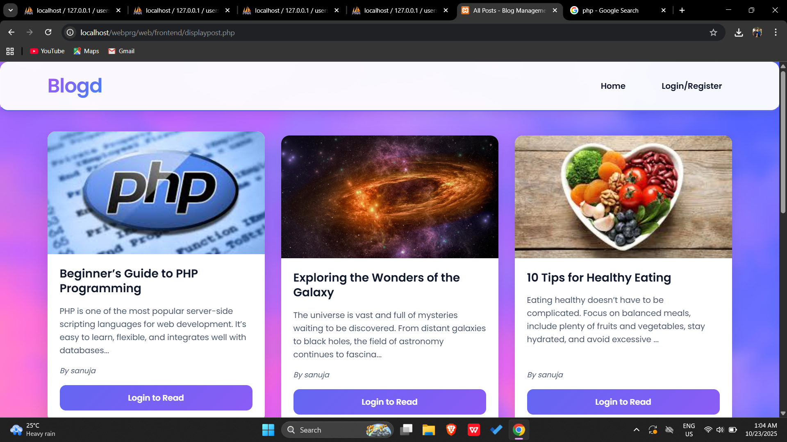
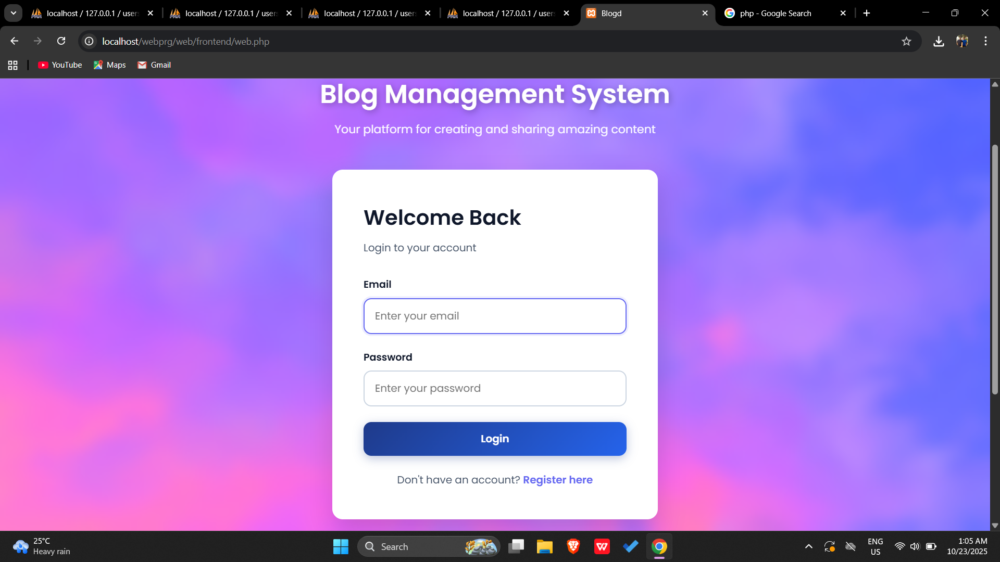
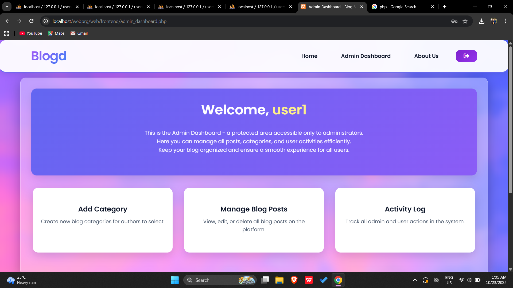
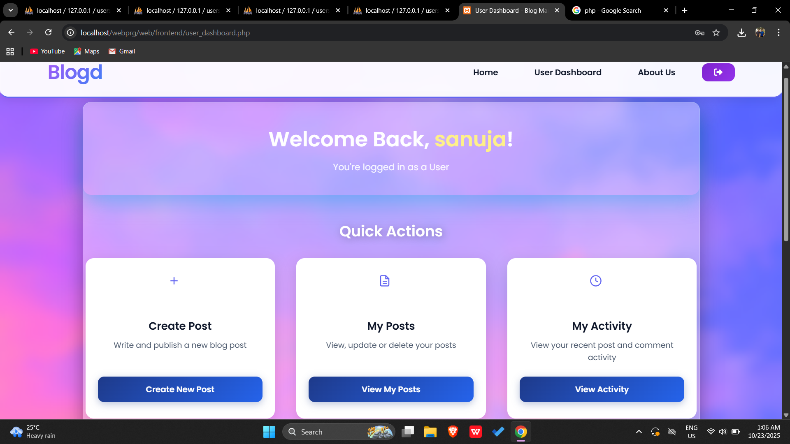

# 📝 Blogd - Blog Management System

A modern, feature-rich blog management system built with PHP, MySQL, and modern CSS. This platform allows users to create, manage, and share blog posts with an intuitive interface and robust admin controls.


---

## 🚀 Features

### 👤 User Features
- **User Authentication**: Secure login and registration system with role-based access (User/Admin)
- **Create Posts**: Rich post creation with title, content, category, and image upload
- **Edit & Delete**: Full control over your own posts
- **Comment System**: Engage with other users through comments
- **Activity Tracking**: View your personal activity history
- **My Posts Dashboard**: Manage all your posts in one place

### 🛡️ Admin Features
- **Admin Dashboard**: Comprehensive control panel for site management
- **Category Management**: Create and manage blog categories
- **Post Moderation**: View and delete any post on the platform
- **Activity Monitoring**: Track all user activities across the platform
- **User Management**: Monitor user actions and content

### 🎨 Design Features
- **Modern UI/UX**: Clean, gradient-based design with smooth animations
- **Responsive Layout**: Fully mobile-friendly and tablet-optimized
- **Card-Based Design**: Beautiful post preview cards with hover effects
- **Fixed Header Navigation**: Always-accessible navigation bar
- **Interactive Elements**: Smooth transitions and micro-interactions
- **Professional Footer**: Social media integration and quick links

---

## 📋 Prerequisites

Before you begin, ensure you have the following installed:
- **PHP** 7.4 or higher
- **MySQL** 8.0 or higher
- **Apache/Nginx** web server
- **phpMyAdmin** (optional, for database management)

---

## 🔧 Installation

### 1. Clone the Repository
```bash
git clone https://github.com/sanuja03/blogd.git
cd blogd
```

### 2. Database Setup

#### Create Database
```sql
CREATE DATABASE blogd_db CHARACTER SET utf8mb4 COLLATE utf8mb4_unicode_ci;
```

#### Create Tables

**Users Table:**
```sql
CREATE TABLE users (
    id INT AUTO_INCREMENT PRIMARY KEY,
    name VARCHAR(100) NOT NULL,
    email VARCHAR(100) UNIQUE NOT NULL,
    password VARCHAR(255) NOT NULL,
    role ENUM('User', 'Admin') DEFAULT 'User',
    created_at TIMESTAMP DEFAULT CURRENT_TIMESTAMP
);
```

**Categories Table:**
```sql
CREATE TABLE categories (
    cat_id INT AUTO_INCREMENT PRIMARY KEY,
    cat_name VARCHAR(100) UNIQUE NOT NULL,
    created_at TIMESTAMP DEFAULT CURRENT_TIMESTAMP
);
```

**Posts Table:**
```sql
CREATE TABLE posts (
    post_id INT AUTO_INCREMENT PRIMARY KEY,
    p_title VARCHAR(255) NOT NULL,
    content TEXT NOT NULL,
    auth_id INT NOT NULL,
    category_id INT NOT NULL,
    image VARCHAR(255),
    date TIMESTAMP DEFAULT CURRENT_TIMESTAMP,
    FOREIGN KEY (auth_id) REFERENCES users(id) ON DELETE CASCADE,
    FOREIGN KEY (category_id) REFERENCES categories(cat_id) ON DELETE CASCADE
);
```

**Comments Table:**
```sql
CREATE TABLE comments (
    com_id INT AUTO_INCREMENT PRIMARY KEY,
    p_id INT NOT NULL,
    user_name VARCHAR(100) NOT NULL,
    comment TEXT NOT NULL,
    created_at TIMESTAMP DEFAULT CURRENT_TIMESTAMP,
    FOREIGN KEY (p_id) REFERENCES posts(post_id) ON DELETE CASCADE
);
```

**Activities Table:**
```sql
CREATE TABLE activities (
    id INT AUTO_INCREMENT PRIMARY KEY,
    user_id INT NOT NULL,
    post_id INT,
    action VARCHAR(50) NOT NULL,
    description TEXT NOT NULL,
    created_at TIMESTAMP DEFAULT CURRENT_TIMESTAMP,
    FOREIGN KEY (user_id) REFERENCES users(id) ON DELETE CASCADE,
    FOREIGN KEY (post_id) REFERENCES posts(post_id) ON DELETE SET NULL
);
```

### 3. Configure Database Connection

Edit `back.php` with your database credentials:
```php
<?php
$servername = "localhost";
$username = "your_username";
$password = "your_password";
$dbname = "blogd_db";

$conn = new mysqli($servername, $username, $password, $dbname);

if ($conn->connect_error) {
    die("Connection failed: " . $conn->connect_error);
}
?>
```

### 4. Create Image Upload Directory
```bash
mkdir image
chmod 755 image
```

### 5. Start the Application

If using PHP built-in server:
```bash
php -S localhost:8000
```

Or configure your Apache/Nginx virtual host to point to the project directory.

---

## 📁 Project Structure

```
blogd/
│
├── image/                      # Image uploads directory
├── about.php                   # About the website
├── addcat.php                  # Admin can add categories
├── admin_activity.php          # Admins view of activities
├── admin_dashboard.php         # Admins dashboard
├── adminblog.php               # Admin can see all blogs and delete them
├── back.php                    # Connects to databse
├── bg.jpg                      # background picture of the website
├── blog.env                    # store sensitive data
├── deletepost.php              # Delete post
├── displaypost.php             # Displays posts to users, admin and non users as a preview
├── footer.php                  # Common footer
├── front.js                    # Frontend javascript
├── header.php                  # Common header
├── index.php                   # First file in browser
├── insertcomment.php           # Add comments
├── login_register.php          # Login/register logic
├── logout.php                  # Logout logic
├── myposts.php                 # Users see their posts
├── post.php                    # Add posts
├── privacy.php                 # Privacy policy of Blogd
├── updatepost.php              # Users edit post
├── user_activity.php           # Activity of each user
├── user_dashboard.php          # Users dashboard
├── web.css                     # All css elements
├── web.php                     # Login/register forms
└── readme.md                   # This file
```

---

## 🎯 Usage Guide

### For Users

1. **Registration**
   - Navigate to the login page
   - Click "Register here"
   - Fill in username, email, password, and select "User" role
   - Submit the form

2. **Creating a Post**
   - Log in to your account
   - Navigate to "User Dashboard"
   - Click "Create New Post"
   - Fill in title, content, select category, and upload an image
   - Submit the post

3. **Managing Posts**
   - Go to "My Posts" to see all your posts
   - Click "Update" to edit a post
   - Click "Delete" to remove a post
   - View comments on your posts

4. **Viewing Posts**
   - Browse all posts on the home page
   - Click on a post card to read the full content
   - Add comments to engage with authors

### For Admins

1. **Access Admin Dashboard**
   - login with "Admin" role
   - Navigate to "Admin Dashboard"

2. **Manage Categories**
   - Add new blog categories from the dashboard
   - Categories appear in the post creation dropdown

3. **Moderate Posts**
   - View all posts in the admin panel
   - Delete inappropriate or spam posts
   - Monitor post activity

4. **Track Activities**
   - View comprehensive activity log
   - Monitor user actions and post history

---


## 🔒 Security Features

- **Password Hashing**: User passwords are hashed using PHP's `password_hash()`
- **SQL Injection Protection**: Prepared statements used throughout
- **Session Management**: Secure session handling for authentication
- **Role-Based Access Control**: Separate permissions for Users and Admins
- **XSS Protection**: HTML special characters escaped in output
- **CSRF Protection**: Form validation and session checks

---

## 📱 Responsive Breakpoints

- **Desktop**: 1024px and above
- **Tablet**: 768px - 1023px
- **Mobile**: Below 768px
- **Small Mobile**: Below 480px

---

## 🐛 Known Issues & Limitations

- File upload size limited by PHP configuration
- No password recovery functionality yet
- Comments cannot be edited or deleted by users
- No email notification system
- No user profile customization

---

## 🚀 Future Enhancements

- [ ] Email verification for registration
- [ ] Password reset functionality
- [ ] User profile pages with avatars
- [ ] Post search and filtering
- [ ] Rich text editor for posts
- [ ] Social media sharing
- [ ] Like/dislike system for posts
- [ ] Notification system
- [ ] Draft post saving
- [ ] Multi-language support

---


## 📄 License

This project is licensed under the MIT License - see the [LICENSE](LICENSE) file for details.

---

## 👨‍💻 Author

**Sanuja Alphonsus**

- LinkedIn: [linkedin.com/in/sanuja-alphonsus](https://www.linkedin.com/in/sanuja-alphonsus)
- GitHub: [@yourusername](https://github.com/sanuja03)

---

## 🙏 Acknowledgments

- Font Awesome for icons
- Google Fonts (Poppins)
- Inspiration from modern blogging platforms
- PHP and MySQL communities

---

---

## 📸 Screenshots

### Home Page - Post Grid


### Login/Register Page


### Admin Dashboard


### Create/Edit Post


### Full Post View


---

**⭐ If you find this project helpful, please consider giving it a star!**

---

*Last Updated: October 2025*